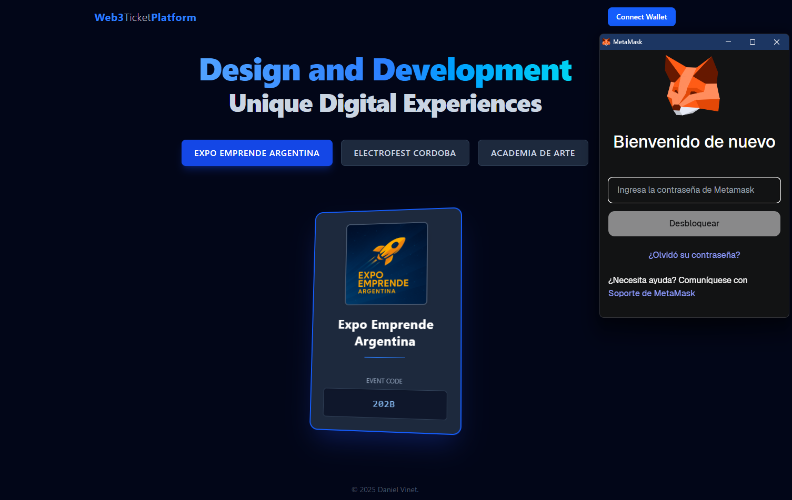

# Web3 3D Tickets



Entorno local full-stack para **Web3 3D Tickets**, un proyecto educativo diseñado para demostrar una arquitectura moderna de dApp de extremo a extremo.

El proyecto corre en **4 contenedores Docker** orquestados:

1.  **Frontend:** Next.js + Wagmi
2.  **Backend:** API GraphQL (Node + Apollo)
3.  **Base de Datos:** MongoDB
4.  **Blockchain:** Nodo local de Hardhat (Ethereum)

---

## 🚀 Ejecutar localmente (Modo Educativo)

```bash
# Construye imágenes y levanta los 4 servicios
npm start
```

Una vez que los contenedores estén corriendo:

- **Frontend:** [http://localhost:3000](https://www.google.com/search?q=http://localhost:3000)
- **API (GraphQL):** [http://localhost:4000/graphql](https://www.google.com/search?q=http://localhost:4000/graphql)
- **Blockchain (RPC):** `http://localhost:8545`

---

## 🧠 Flujo de Uso Educativo (Cómo probar el proyecto)

Para probar la funcionalidad Web3, necesitas conectar tu MetaMask al nodo local de Hardhat que corre en Docker.

### 1\. Configura MetaMask

1.  Abre MetaMask, haz clic en el selector de redes (arriba a la izquierda).
2.  Selecciona "Añadir red" \> "Añadir una red manualmente".
3.  Ingresa los siguientes datos:
    - **Nombre de la red:** `Local Hardhat`
    - **Nueva URL de RPC:** `http://localhost:8545`
    - **ID de cadena:** `31337`
    - **Símbolo de moneda:** `ETH`

### 2\. Importa una Cuenta con Fondos

1.  En la terminal donde corres `npm start`, busca el log del contenedor `web3tickets_blockchain`.
2.  Hardhat mostrará una lista de "Cuentas". Copia la **Clave Privada** (Private Key) de cualquiera de ellas (ej. `0xac09...`).
3.  En MetaMask, haz clic en "Importar cuenta" y pega la clave privada.
4.  ¡Listo\! Ahora tienes una cuenta en tu red local con 10,000 ETH de prueba.

### 3\. Prueba la Aplicación

1.  **Visita [http://localhost:3000](https://www.google.com/search?q=http://localhost:3000)**. Verás los eventos disponibles.
2.  **Conecta tu Wallet:** Haz clic en el botón de "Iniciar Sesión" (o "Connect Wallet") en el header y conecta tu cuenta de "Local Hardhat".
3.  **Navegación (Logueado):** El header cambiará, mostrando "Eventos", "Mis Tickets" y "Perfil".
4.  **Adquirir un Ticket:** Ve a "Eventos", elige uno y haz clic en "Adquirir Ticket". MetaMask se abrirá pidiéndote que firmes la transacción (esto _mintea_ un ticket NFT en tu blockchain local).
5.  **Ver tus Tickets:** Ve a "Mis Tickets". Ahora verás el evento que adquiriste, pero esta vez **mostrará el código de ticket** que se generó y que está asociado a tu NFT.

---

## 🧰 Otros comandos

```bash
npm run dev    # Ejecutar usando imágenes cacheadas (sin reconstruir)
npm run stop   # Detener los contenedores
npm run clean  # Detener + remover volúmenes + limpiar sistema
```

---

## 🧩 Stack y Estructura

```
web3-3d-tickets/
│
├── backend/                  # API GraphQL (Node + Apollo + MongoDB)
├── blockchain/               # Nodo local (Hardhat)
├── frontend/                 # App Frontend (Next.js + Wagmi)
│
├── docker-compose.yml        # Orquesta los 4 servicios
├── package.json              # Scripts raíz
└── README.md
```

| Layer             | Tech                          | Propósito                                                  |
| :---------------- | :---------------------------- | :--------------------------------------------------------- |
| **Frontend**      | Next.js, React, Wagmi, Apollo | Interfaz de usuario, conexión de wallet, queries a GraphQL |
| **Backend**       | Node.js, Apollo, Mongoose     | API GraphQL para lógica de negocio (Eventos, Tickets)      |
| **Base de Datos** | MongoDB                       | Persistencia de metadatos (qué usuario posee qué ticket)   |
| **Blockchain**    | Hardhat                       | Nodo local de Ethereum para mintear los tickets (NFTs)     |
| **Infra**         | Docker Compose                | Orquestación de todos los servicios para desarrollo        |

---

## 🪪 Licencia

MIT © 2025 Daniel
